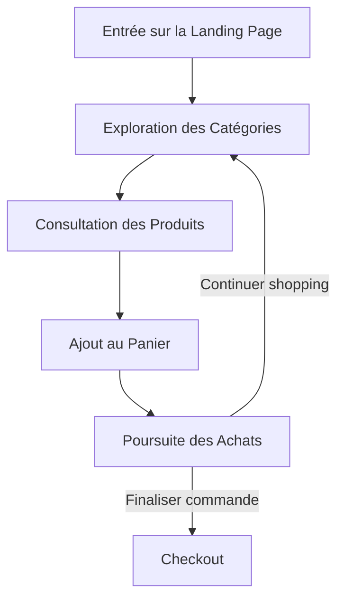
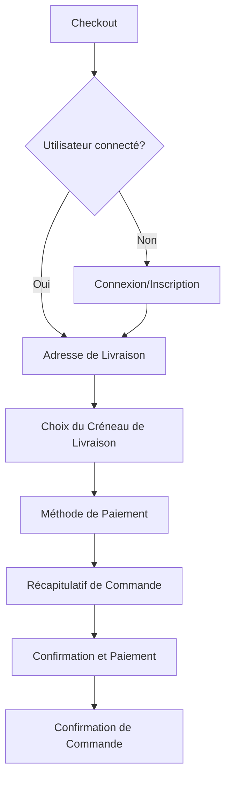
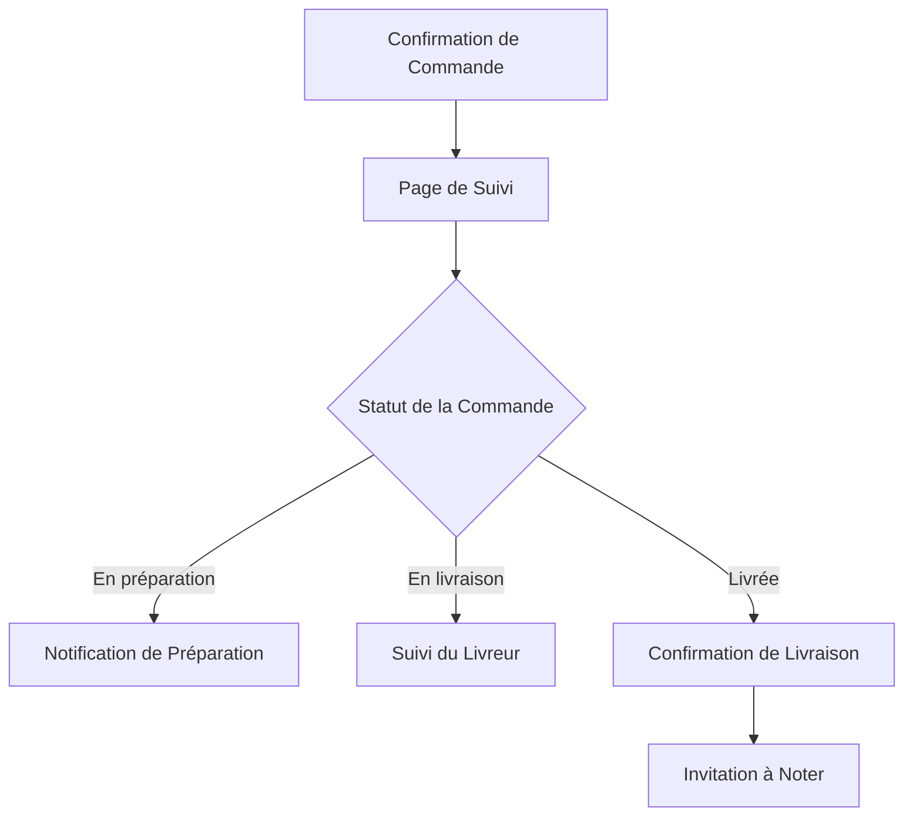
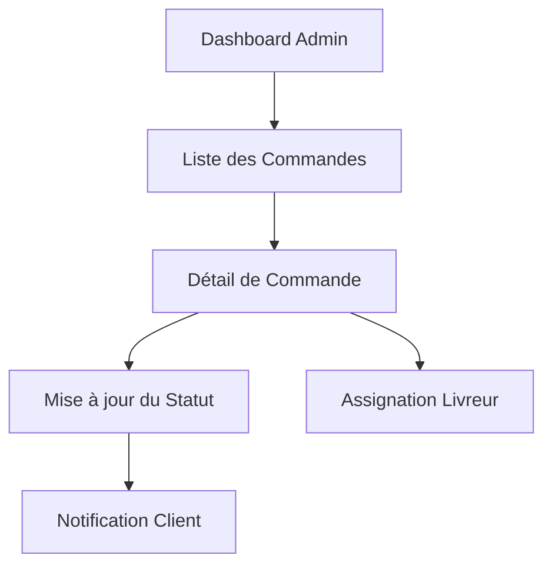
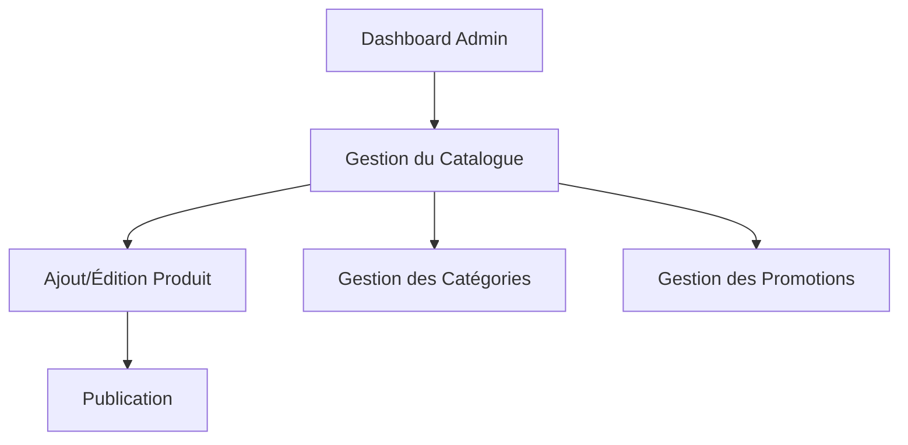
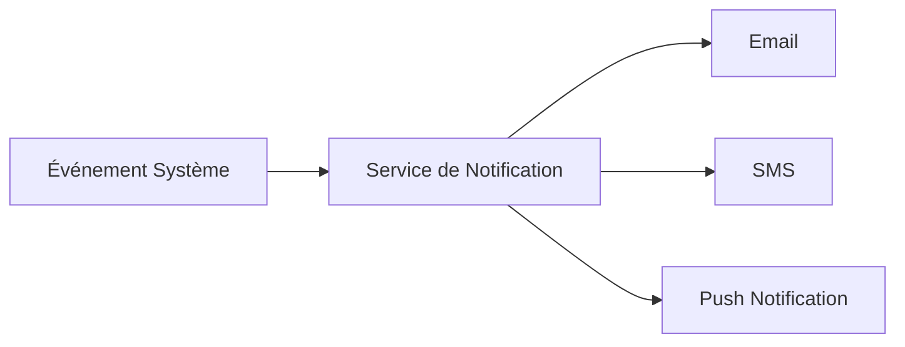
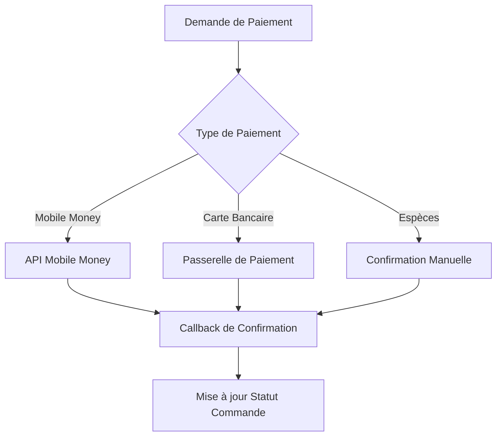

# Flux d'Application - Akanda Apéro

Ce document décrit les différents flux d'utilisation de l'application Akanda Apéro, du point de vue de l'utilisateur et des processus système.

## Flux Utilisateur Principal

### 1. Découverte et Navigation

#### Détails du Flux
1. **Landing Page**
   - L'utilisateur arrive sur la page d'accueil
   - Visualisation des promotions et catégories principales
   - Possibilité de se connecter/s'inscrire

2. **Exploration des Catégories**
   - Navigation par type de boisson (Cocktails, Bières, Spiritueux, Snacks)
   - Filtrage par prix, popularité, nouveautés

3. **Consultation des Produits**
   - Affichage des détails du produit (description, prix, disponibilité)
   - Visualisation des avis et notes

4. **Ajout au Panier**
   - Sélection de la quantité
   - Ajout au panier avec confirmation visuelle
   - Suggestions de produits complémentaires

5. **Poursuite des Achats**
   - Notification du nombre d'articles dans le panier
   - Option de continuer les achats ou finaliser la commande

### 2. Processus de Commande

#### Détails du Flux
1. **Checkout**
   - Récapitulatif du panier avec possibilité de modifier les quantités
   - Calcul des frais de livraison

2. **Connexion/Inscription**
   - Connexion pour utilisateurs existants
   - Inscription rapide pour nouveaux utilisateurs
   - Vérification de l'âge (≥ 18 ans)

3. **Adresse de Livraison**
   - Sélection d'adresses sauvegardées
   - Ajout d'une nouvelle adresse
   - Validation de la zone de livraison (Libreville uniquement)

4. **Choix du Créneau de Livraison**
   - Sélection de la date et plage horaire
   - Indication des délais estimés

5. **Méthode de Paiement**
   - Options: Espèces à la livraison, Mobile Money, Carte bancaire
   - Sauvegarde des informations de paiement (optionnel)

6. **Récapitulatif et Confirmation**
   - Vérification finale de la commande
   - Termes et conditions
   - Confirmation et traitement du paiement

7. **Confirmation de Commande**
   - Numéro de commande et récapitulatif
   - Instructions de suivi
   - Email de confirmation

### 3. Suivi de Commande

#### Détails du Flux
1. **Page de Suivi**
   - Accès via email de confirmation ou compte utilisateur
   - Affichage du statut en temps réel

2. **Notifications**
   - Notifications push/email à chaque changement de statut
   - Estimation du temps de livraison mise à jour

3. **Suivi du Livreur**
   - Carte de suivi du livreur (si disponible)
   - Coordonnées du livreur

4. **Confirmation et Évaluation**
   - Confirmation de livraison
   - Invitation à évaluer les produits et le service

## Flux Administrateur

### 1. Gestion des Commandes

#### Détails du Flux
1. **Dashboard Admin**
   - Vue d'ensemble des commandes du jour
   - Statistiques et alertes

2. **Gestion des Commandes**
   - Filtrage par statut, date, client
   - Détails complets de chaque commande
   - Mise à jour des statuts avec notifications automatiques

3. **Assignation des Livraisons**
   - Attribution des commandes aux livreurs disponibles
   - Optimisation des itinéraires

### 2. Gestion du Catalogue

#### Détails du Flux
1. **Gestion du Catalogue**
   - Liste complète des produits avec statuts et stocks
   - Filtrage et recherche avancée

2. **Édition des Produits**
   - Formulaire complet (nom, description, prix, images, etc.)
   - Gestion des variantes et options
   - Contrôle des stocks

3. **Gestion des Promotions**
   - Création de promotions temporaires
   - Définition des réductions et conditions

## Intégrations Système

### Notifications

### Paiements

## Considérations Techniques

- **Gestion des Sessions**: Maintien de l'état du panier entre les sessions
- **Gestion des Erreurs**: Processus de récupération pour les pannes de réseau ou erreurs de paiement
- **Performance**: Optimisation des temps de chargement pour les pages critiques (catalogue, checkout)
- **Sécurité**: Validation des entrées utilisateur, protection contre les attaques CSRF, sécurisation des paiements

## Métriques Clés

- Taux de conversion du panier
- Temps moyen pour compléter une commande
- Taux d'abandon de panier
- Valeur moyenne des commandes
- Délai moyen de livraison
- Taux de satisfaction client
