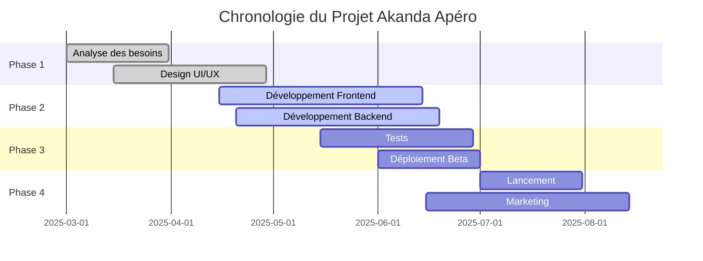

# Statut du Projet Akanda Apéro

*Rapport de statut au 5 mai 2025*

## Vue d'ensemble

Akanda Apéro est une application web de livraison de boissons et snacks à Libreville, Gabon, actuellement en phase de développement. Ce document présente un aperçu détaillé de l'état actuel du projet, des défis rencontrés et des prochaines étapes.

## Tableau de bord

| Indicateur | Statut |
|------------|--------|
| **État global** | 🟡 En cours |
| **Respect du calendrier** | 🟢 Dans les temps |
| **Budget** | 🟢 Conforme aux prévisions |
| **Risques** | 🟡 Modérés |
| **Qualité** | 🟢 Conforme aux attentes |

## Chronologie du projet

## État détaillé par domaine

### 1. Développement Frontend

**Progression**: 65% complété

**Accomplissements récents**:
- Mise en place de l'architecture Next.js avec App Router
- Développement des composants UI réutilisables avec Tailwind CSS
- Implémentation de la page d'accueil et de la navigation
- Intégration des maquettes de design

**En cours**:
- Développement des pages de catégorie et de détail produit
- Implémentation du panier d'achat
- Mise en place du processus de checkout

**Blocages**:
- Optimisation des performances sur mobile (temps de chargement initial > 2.5s)
- Problèmes d'affichage sur certains navigateurs plus anciens

**Prochaines étapes**:
- Finaliser les pages produit et panier d'ici le 10 mai
- Implémenter l'authentification utilisateur d'ici le 15 mai
- Optimiser les performances pour réduire le temps de chargement initial

### 2. Développement Backend

**Progression**: 40% complété

**Accomplissements récents**:
- Définition de l'architecture backend
- Mise en place des modèles de données avec Prisma
- Configuration de la base de données
- Implémentation des premières API REST

**En cours**:
- Développement des API de gestion des produits
- Mise en place du système d'authentification

**Blocages**:
- Intégration avec les services de paiement locaux (Mobile Money)
- Définition précise des zones de livraison à Libreville

**Prochaines étapes**:
- Finaliser les API d'authentification d'ici le 8 mai
- Développer les API de gestion des commandes d'ici le 15 mai
- Commencer l'intégration des passerelles de paiement

### 3. Design et Expérience Utilisateur

**Progression**: 95% complété

**Accomplissements récents**:
- Finalisation de la charte graphique
- Création des maquettes pour toutes les pages principales
- Design des composants UI
- Adaptation responsive pour mobile, tablette et desktop

**En cours**:
- Ajustements mineurs basés sur les retours d'équipe
- Design des emails transactionnels

**Blocages**:
- Aucun blocage majeur

**Prochaines étapes**:
- Finaliser les éléments graphiques pour les promotions
- Créer les assets pour la campagne marketing de lancement

### 4. Tests et Assurance Qualité

**Progression**: 15% complété

**Accomplissements récents**:
- Mise en place de l'environnement de test
- Définition de la stratégie de test

**En cours**:
- Développement des tests unitaires pour les composants UI
- Mise en place des tests automatisés

**Blocages**:
- Ressources limitées pour les tests manuels

**Prochaines étapes**:
- Augmenter la couverture des tests unitaires à 50% d'ici fin mai
- Commencer les tests d'intégration d'ici le 20 mai
- Planifier les tests utilisateurs pour début juin

### 5. Infrastructure et Déploiement

**Progression**: 10% complété

**Accomplissements récents**:
- Configuration de l'environnement de développement
- Mise en place du pipeline CI/CD initial

**En cours**:
- Préparation de l'environnement de staging

**Blocages**:
- Choix final de l'hébergement pour la production

**Prochaines étapes**:
- Finaliser la configuration de l'environnement de staging d'ici le 15 mai
- Définir la stratégie de déploiement et de scaling
- Mettre en place le monitoring et les alertes

## Analyse des risques

| Risque | Probabilité | Impact | Stratégie d'atténuation |
|--------|-------------|--------|-------------------------|
| Retard dans l'intégration des paiements | Moyenne | Élevé | Commencer les discussions avec les fournisseurs de services de paiement dès maintenant |
| Problèmes de performance | Moyenne | Moyen | Mettre en place des tests de performance tôt et optimiser progressivement |
| Couverture géographique incomplète | Élevée | Moyen | Définir clairement les zones de livraison initiales et planifier l'expansion |
| Sécurité des données utilisateurs | Faible | Élevé | Mettre en place des audits de sécurité et suivre les meilleures pratiques RGPD |
| Adoption utilisateur lente | Moyenne | Élevé | Préparer une stratégie marketing solide et des offres de lancement attractives |

## Métriques clés

| Métrique | Objectif | Actuel | Tendance |
|----------|----------|--------|----------|
| Temps de développement | 4 mois | En cours (2 mois) | ↔️ Dans les temps |
| Budget consommé | 100% | 45% | ↔️ Conforme |
| Couverture de tests | 80% | 15% | ⬆️ En augmentation |
| Performance Lighthouse | Score > 90 | Score 85 | ⬆️ En amélioration |
| Tickets résolus | 100% | 68% | ⬆️ En progression |

## Rétrospective Sprint Actuel

**Points positifs**:
- Bonne collaboration entre les équipes design et développement
- Adoption rapide des nouvelles technologies (Next.js App Router)
- Documentation complète et à jour

**Points à améliorer**:
- Communication avec les parties prenantes externes
- Estimation plus précise des tâches complexes
- Augmentation de la couverture des tests

**Actions pour le prochain sprint**:
- Organiser une réunion hebdomadaire avec toutes les parties prenantes
- Revoir le processus d'estimation des tâches
- Allouer plus de ressources aux tests

## Besoins en ressources

| Ressource | Statut | Action requise |
|-----------|--------|----------------|
| Développeurs Frontend | ✅ Suffisant | Aucune |
| Développeurs Backend | ⚠️ Limité | Envisager un recrutement |
| Designers | ✅ Suffisant | Aucune |
| Testeurs QA | ❌ Insuffisant | Recruter un testeur QA |
| Infrastructure | ✅ Suffisant | Aucune |

## Prochains jalons importants

1. **15 mai 2025**: Finalisation des fonctionnalités core du MVP
2. **1er juin 2025**: Lancement de la version bêta avec utilisateurs sélectionnés
3. **15 juin 2025**: Fin des tests utilisateurs et corrections
4. **1er juillet 2025**: Lancement officiel de l'application

## Conclusion et recommandations

Le projet Akanda Apéro progresse conformément au calendrier prévu, avec un bon équilibre entre qualité et vitesse de développement. Les principales fonctionnalités du MVP sont en cours de développement, et l'équipe maintient un bon rythme.

**Recommandations**:

1. **Priorité immédiate**: Accélérer l'intégration des services de paiement pour éviter des retards en fin de projet
2. **Ressources**: Renforcer l'équipe QA pour améliorer la couverture des tests
3. **Stratégie**: Commencer à préparer la stratégie marketing et de lancement dès maintenant
4. **Technique**: Mettre l'accent sur l'optimisation des performances mobiles

---

*Ce document est mis à jour bi-mensuellement. Dernière mise à jour: 5 mai 2025*
